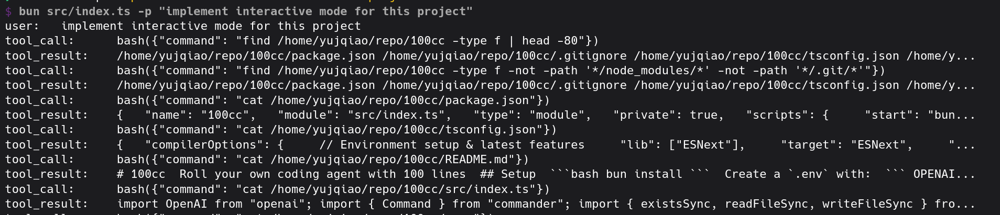
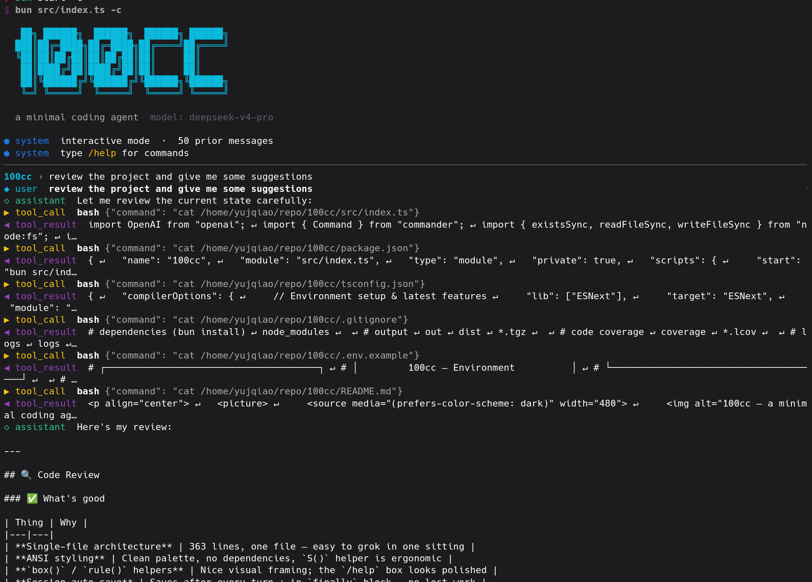

# 100cc

Roll your own coding agent [with 100 lines](./src/index.ts)

The idea is simple. Write the bare minimal harness by hand and then ask it to write itself.

[blog post about this](https://blog.yqiao.me/2026/06/100cc-roll-your-own-claude-code-with.html)

## Setup

```bash
bun install
```

Create a `.env` with:

```
OPENAI_API_KEY=...        # required
OPENAI_MODEL=...          # required
OPENAI_BASE_URL=...       # optional, defaults to OpenAI's official endpoint
```

## Run

It starts with the bare minimal. Only non-interactive mode(`-p`) is implemented

```bash
bun start -- -p "review this project and add 3 jokes to README.md"
```

Ask it to write itself
```bash
bun start -- -c -p "implement interactive mode for this project"  # -c to continue from the last session
```




Get some eyecandy
```bash
bun start -- -c -p "make this project look nicer"
```



## Going Further

Ask your 100cc to implement [TODO.md](./TODO.md)

Have fun and share with your friends!

---

This repo tries to keep the signal to noise ratio high and adhere to [showing less output](https://blog.yqiao.me/2026/05/show-me-less-output.html)